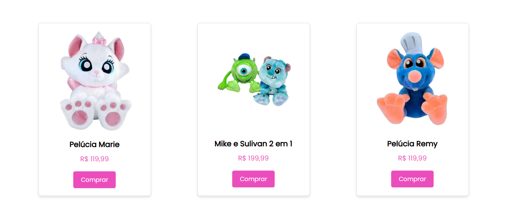
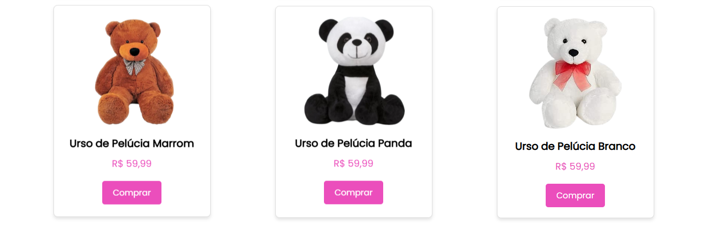
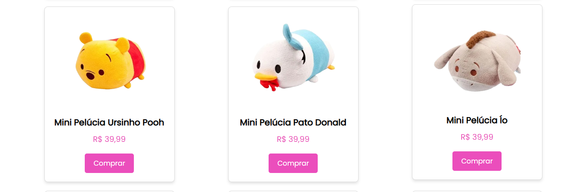
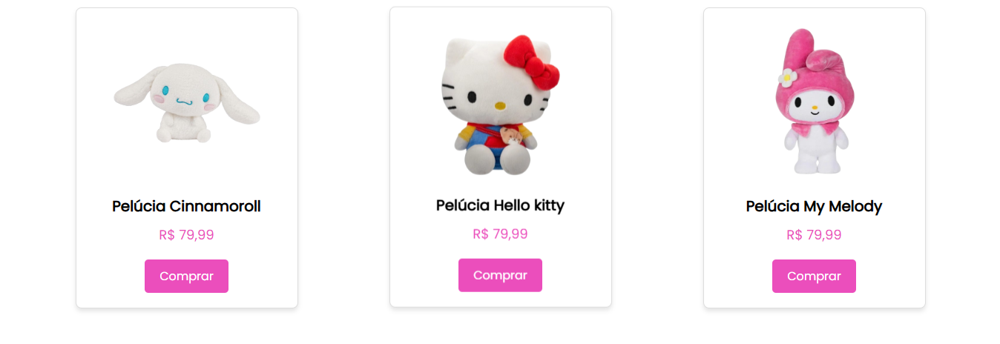

# Loja de Pelúcias

Este projeto é uma página de e-commerce para uma loja de pelúcias. A loja exibe produtos de pelúcias, organizados em categorias como Disney, Ursinhos, Mini Pelúcias e Sanrio. O site é responsivo, com um carrossel interativo de produtos populares e uma seção de catálogo para facilitar a navegação entre os itens.

---

## 🚀 Funcionalidades

- **Carrossel de Produtos**: Exibe os produtos mais procurados, permitindo navegação para frente e para trás.
- **Catálogo de Produtos**: Produtos organizados em categorias como Disney, Ursinhos, Mini Pelúcias e Sanrio.
- **Busca de Produtos**: Campo de busca para encontrar pelúcias específicas (ainda sem funcionalidade implementada).
---

## 🛠 Tecnologias Utilizadas

Este projeto utiliza as seguintes tecnologias:

- **HTML5**: Estrutura do conteúdo.
- **CSS3**: Estilo visual e layout responsivo.
- **JavaScript**: Funcionalidade para navegação do carrossel.
- **Font Awesome**: Ícones utilizados na interface.
- **Google Fonts**: Fonte personalizada "Poppins" para estilo de texto.

---

## 📂 Estrutura do Projeto

A estrutura do diretório é organizada da seguinte forma:

```
/plushies-store
├── index.html          # Página principal com o conteúdo e estrutura do site.
├── styles.css          # Arquivo de estilos do site.
├── script.js           # Funcionalidade do carrossel e interatividade.
├── /assets             # Imagens e recursos visuais.
├── /Carrosel       # Imagens utilizadas no carrossel de produtos.
├── /Catálogo       # Imagens dos produtos no catálogo.
└── Logo.png        # Logotipo da loja.
```

### `index.html`

- Contém a estrutura HTML da página inicial, com o carrossel e o catálogo de produtos.

### `styles.css`

- Define o estilo visual do site, com ênfase no design responsivo, layout e animações.

### `script.js`

- Responsável pela lógica do carrossel de produtos, permitindo navegação entre os itens.

### `/assets/`

- Contém imagens utilizadas na página, como os produtos do catálogo e o logotipo da loja.

---

## 👀 Demonstração







## 💡 Funcionalidades e Design

- **Carrossel de Produtos**: A seção do carrossel exibe os produtos mais procurados, permitindo a navegação usando botões de "próximo" e "anterior". O código JavaScript controla o movimento do carrossel.
- **Catálogo de Produtos**: Apresenta diferentes categorias de produtos, como Disney, Ursinhos, Mini Pelúcias e Sanrio, com uma interface de compra simples.
- **Interatividade**: Botões de compra e navegação tornam a experiência do usuário mais dinâmica e intuitiva.

---

## 📅 Planejamento Futuro

- **Implementação da Busca**: Adicionar a funcionalidade de busca de produtos.
- **Integração com Backend**: Futuramente, o site pode ser integrado com um backend para gerenciar estoque, pedidos e usuários.
- **Melhorias no Design**: Adicionar animações e transições mais dinâmicas para melhorar a experiência do usuário.

---

## 🤝 Como Contribuir

1. Faça um **fork** do repositório.
2. Crie uma **branch** para suas alterações
3. Faça suas modificações e adicione seus commits.
4. Envie um **pull request** explicando suas alterações.

---

## 📝 Licença

Este projeto está licenciado sob a **Licença MIT**. Veja o arquivo [LICENSE](LICENSE) para mais informações.

---

## 📬 Contato

Para dúvidas ou sugestões, entre em contato comigo através do e-mail:

📧 **viniciusrenectt@gmail.com**
